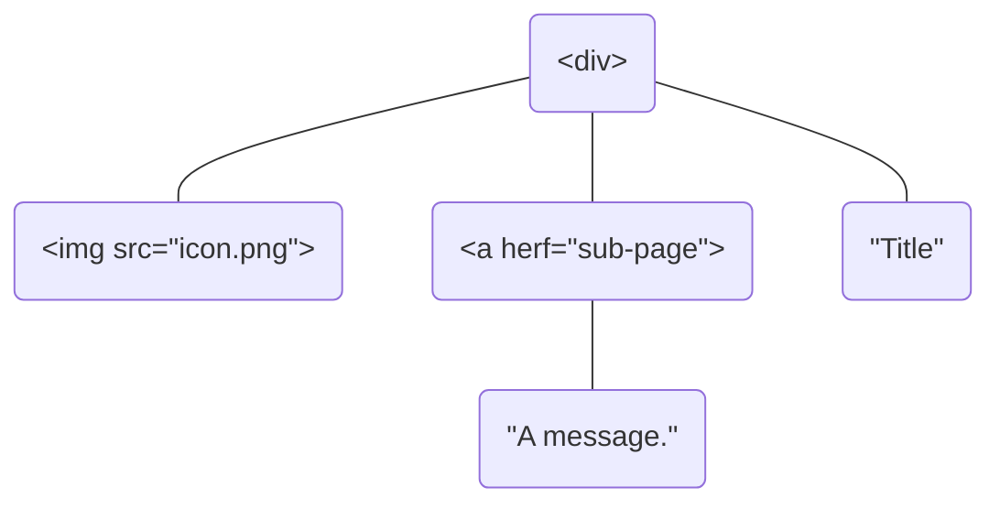

# CSS 解析器：选择器算法

这篇教程教你用 Haskell 实现一个简单的 CSS 解析器（准确来说其实是求解 CSS 选择器）。如果你是不满足于编写几行 Haskell 函数的初学者，不妨来看看这个教程🐒。

<!-- more -->

本教程并不涉及真正的 Web 技术——它基本上只是一个以 Web 相关问题作为背景的一个习题，所以没有 Web 经验的人应该也不会感到困难。

## 前置知识

阅读本教程前你需要掌握以下 Haskell 概念：
- 函数定义
- Lambda 表达式

## CSS 简介

CSS 是用来描述 Web 界面元素的一系列规则，例如：
``` css
p {
  color: white; /* 将文本颜色设置为白色 */
  font-size: 18px; /* 将字号设置为 18 像素大 */
}

.panel {
  background-color: gray;
  border-radius: 2px;
}
```
这段 CSS 将作用到 HTML 中的类型为 `p` 和 `class` 属性为 `"panel"` 的所有元素，本教程涉及的 CSS 基本都是这样子。它们由这样的结构重复组成：
```
selector { rule-set }
```
其中有两条规则：
1. 位于花括号前面的 `selector` 部分是选择器，它决定 CSS 规则会对页面中哪些元素起作用。
2. 花括号里面的 `rule-set` 部分是规则集合，也就是元素与选择器匹配时起作用的样式属性。

规则集合是一些属性名和属性值组成的键值对，属性名和属性值之间用 `:` 分隔，而两个属性键值对之间用 `;` 分隔。

选择器的规则稍微复杂一点，在本教程中我们打算支持这些[选择器](https://developer.mozilla.org/en-US/docs/Web/CSS/CSS_Selectors)：
- 通用选择器（Universal selector）：选择所有元素。写作 `*`。
- 元素选择器（Type selector）：选择所有给定类型名称的元素。写作类型的名称，例如 `div`，`input`。
- 类选择器（Class selector）：选择所有具有给定 `class` 属性值的元素。以 `.` 开头，例如 `.window`。
- ID 选择器（ID selector）：选择所有具有指定 `id` 属性的元素。以 `#` 开头，例如 `#title`。
- 分组选择器（Grouping selector）：使用 `,` 组合多个选择器，例如 `div, #title, .window`。元素匹配到分组选择器中的任意选择器即可。
- 后代组合器（Descendant combinator）：通过空格组合两个选择器，例如 `div .icon`。只有当元素有祖先匹配第一个选择器且元素本身匹配第二个选择器时后代组合器才匹配。
- 直接子代组合器（Child combinator）：通过 `>` 组合两个选择器，例如 `div > .icon`。仅当父级元素匹配第一个选择器且元素本身匹配第二个选择器时直接子代组合器才匹配。

单独的背景知识介绍就到这里吧，其他细节我会在后面中补充。

## 用 Haskell 表示数据

### 选择器

我定义了一个 `Selector` 类型表示各种选择器：
``` haskell
data Selector
  = SelectorUniversal -- 通用选择器（*）
  | SelectorType String -- 元素选择器
  | SelectorClass String -- 类选择器
  | SelectorId String -- ID 选择器
  | SelectorDescendent Selector Selector -- 后代选择器
  | SelectorChild Selector Selector -- 直接后代选择器
  | SelectorList [Selector] -- 分组选择器
  deriving (Show, Eq)
```
在这个定义中，一个 `Selector` 可以由多种方法来构造（以 `|` 分隔）。第 9 行声明了 `Selector` 类型继承自 `Show` 和 `Eq` 类型类，这会自动让 `Selector` 类型具有相等性判别和使用 `show`、`print` 函数打印的能力。不妨在 GHCi 中尝试一下：
``` haskell
ghci> SelectorClass "icon"
SelectorClass "icon" -- 类选择器 .icon
ghci> SelectorDescendent (SelectorId "window") SelectorUniversal
SelectorDescendent (SelectorId "window") SelectorUniversal -- 后代选择器 #window *
ghci> SelectorClass "icon" == SelectorClass "icon"
True
```

::: tip
为什么不使用 CSS 文本形式的选择器呢？因为把文本解析成 `Selector` 需要更多的知识，这超出了本教程的范围。接下来我还会直接用 Haskell 代码构造其他数据。
:::

### DOM 节点

在真实的 HTML 中 DOM 节点包含元素（element）节点和文本（text）节点两种。例如
``` html
<div>
  
  <a herf="sub-page">Title</a>
  A message.
</div>
```
的 DOM 树结构为

DOM 元素还可以包含若干属性（attributes）
``` html

```
HTML 中一个节点的属性就是写作 `key="value"` 形式的键值对集合。很显然只有元素节点能填写属性，而文本节点不能。

CSS 选择器会作用于各种匹配的 DOM 节点并为后者绑定具体的样式规则。为此还得在 Haskell 中定义 DOM 树才能让选择器有用武之地。简单起见，本教程将只考虑元素节点，而元素节点可以简单地定义如下
``` haskell
import qualified Data.Map as M

data Element = Element
  { elName :: String -- ^ 元素的类型名，例如 div, img, p 等
  , elAttrs :: M.Map String AttrValue -- ^ 元素属性键值对
  , elChildren :: [Element] -- ^ 子元素列表
  } deriving (Show, Eq)
```
本教程中的 `Element` 结构只包含 CSS 选择器必要的成员字段：元素类型名、元素属性列表和子元素列表。其中，元素属性键值对是一个键为 `String`，值为 `AttrValue` 类型的 map（数据结构是红黑树，可以在 $O(\log n)$ 的时间复杂度内通过键找到值）。

根据本教程的需要，属性值类型 `AttrValue` 可以有多种不同的构造：
``` haskell
data AttrValue
  = NoneValue -- ^ 未定义属性
  | TextValue String -- ^ 属性的字符串值
  | DictValue (M.Map String String) -- ^ 属性的键值对值（键和值都是字符串）
  deriving Eq
```
`TextValue` 和 `DictValue` 是常用的属性构造函数，例如属性 `id="elem1"` 的属性值是 `TextValue "elem1"`；而 `style="color:red;font-size:24pt"` 的属性值则是
``` haskell
DictValue $ M.fromList
  [ ("color", "red") -- color: red
  , ("font-size", "24pt") -- font-size: 24pt
  ]
```
`NoneValue` 表示属性未被定义，我们不会主动给属性指定这个值，它的作用会在后面说明。

### 简化书写

有了前面的类型定义，DOM 元素的定义和使用还是比较麻烦的，所以我们可以定义一些函数来简化代码。首先是元素的定义函数：
``` haskell
element :: String -> [(String, AttrValue)] -> [Element] -> Element
element name attrs = Element name (M.fromList attrs)
```
由于 Haskell 是默认[柯里化](https://wiki.haskell.org/Currying)的，`element` 函数的定义中省略了第三个形式参数，上面的定义和
``` haskell
element name attrs children = Element name (M.fromList attrs) children
```
是等效的，后者还会让 HLint 代码检查工具给出简化建议。

相比于直接使用 `Element` 构造函数，`element` 函数接受的是 `[(String, AttrValue)]` 类型（也就是属性键值对的列表），调用时不必再多写一次 `M.fromList`：
``` haskell
-- 使用 Element 构造函数时要用 `M.fromList` 从 [(String, AttrValue)] 构造 M.Map String AttrValue
el1 = Element "div" (M.fromList [("id", Text "elem1")]) []
-- element 函数则不需要，还少了一对括号
el2 = element "div" [("id", Text "elem1")] []
```
不过属性还是不太好写，例如 `id="elem1"` 要写作 `("id", TextValue "elem1")`。事实上 `id` 属性总是具有 `TextValue` 构造的值，以此类推可以定义这样几个辅助函数：
``` haskell
-- | 元素的 id 属性键值对（id="elem-id"）
attrId :: String -> (String, AttrValue)
attrId s = ("id", TextValue s)

-- | 元素的 class 属性键值对（class="class-name"）
attrClass :: String -> (String, AttrValue)
attrClass s = ("class", TextValue s)
```
有了这些函数，DOM 元素的书写就更简单一些了：
``` haskell
el2 = element "div" [attrId "elem1"] []
```
这种做法还可以避免将属性的类型写错。

## DOM 树打印

到此为止 CSS 选择器问题需要的主要数据类型都已经定义好了。并且还可以用 Haskell 代码表达类似 HTML 的 DOM 结构，例如
``` html
<div id="window">
  <p class="title"> ... </p>
  <p id="brief" class="content"> ... </p>
  <div class="panel flex">
    
    <a id="ref-link" href="/sub-page" />
  </div>
  <p class="footnote"> ... </p>
</div>
```
在 Haskell 中可以这样写（忽略了文本节点）：
``` haskell
dom :: Element
dom =
  element "div" [attrId "window"] [
    element "p" [attrClass "title"] [],
    element "p" [attrId "brief", attrClass "content"] [],
    element "div" [attrClass "panel flex"] [
      element "img" [attrClass "icon", ("src", TextValue "logo.png")] [],
      element "a" [attrId "ref-link", ("herf", TextValue "/sub-page")] []
    ],
    element "p" [attrClass "footnote"] []
  ]
```

本教程完成时会把一整个 CSS 规则作用在这个 DOM 数上并得到各元素绑定的样式规则，此时需要以合适的方式展示结果。从经验上来说，文本形式的结果应该就足够了。

### `show` 还不够！

由于 `Element` 类型继承自 `Show`，所以可以使用 `show` 方法将它序列化成字符：
``` haskell
ghci> dom -- 在 GHCi 中这相当于 print dom 或者 putStrLn (show dom) 
Element {elName = "div", elAttrs = fromList [("id",TextValue "window")], elChildren = [
  Element {elName = "p", elAttrs = fromList [("class",TextValue "title")], elChildren = []},
  Element {elName = "p", elAttrs = fromList [("class",TextValue "content"),("id",TextValue "brief")], elChildren = []},
  Element {elName = "div", elAttrs = fromList [("class",TextValue "panel flex")], elChildren = [
    Element {elName = "img", elAttrs = fromList [("class",TextValue "icon"),("src",TextValue "logo.png")], elChildren = []},
    Element {elName = "a", elAttrs = fromList [("herf",TextValue "/sub-page"),("id",TextValue "ref-link")], elChildren = []}
  ]},
  Element {elName = "p", elAttrs = fromList [("class",TextValue "footnote")], elChildren = []}
]}
```
可以看到 `show` 基本上是把构造 `dom` 值的整个代码序列化成了文本。事实上 `show` 的输出是没有断行和格式化的，上面已经是我整理后的效果了。很明显 `Show` 类型类所提供的打印不是很可读，我希望有一个可以数据类似 HTML 语法并且自动格式化的 DOM 树打印。

为此我定义了一个 `ShowHtml` 类型类：
``` haskell
class ShowHtml a where
  showHtml :: a -> String
```
该类型类的实例类型 `a` 要实现 `showHtml` 方法将该类型的值打印成 HTML 格式的字符串，这样可以更直观可读地展示信息。

### `Element` 的 `showHtml`

归根结底，我们要把 `Element` 打印成 HTML 格式，因此它是 `ShowHtml` 的实例：
``` haskell
instance ShowHtml Element where
  showHtml = ...
```
`Element` 的 `showHtml` 方法将一个元素和它的子元素递归地序列化为 HTML 文本。为了让输出比较紧凑，我希望没有子节点的元素（叶子节点）只占据一行，并且使用 `<p />` 标签样式而不是 `<p></p>` 样式，例如：
``` html
<div class="panel">
  <p id="content" />
</div>
```

为此可以定义一个 `nest` 函数进行递归序列化：
``` haskell
nest :: Int  -- 元素嵌套深度/缩进层级
  -> Element -- 需要序列化为 HTML 的元素
  -> String  -- 序列化后的 HTML 文本
```
例如 `<div><div>` 中 div 和 img 元素在序列化后会有不同的缩进层级。

由于元素有不同的序列化规则，`nest` 函数需要区分元素是否存在子节点。用模式匹配可以轻松实现：
``` haskell
nest d x | null (elChildren x) = -- 没有子节点，序列化为 <p /> 形式
nest d x = -- 其他情况序列化成 <div> children </div> 形式
```
模式匹配语法会判定多个函数定义体上的条件表达式，并执行条件为真的函数体。在这里，第 1 行中 `|` 和 `=` 之间的条件表达式判断元素 `x` 的 `elChildren` 成员是否为空列表，所以这个模式对应元素没有子元素的情况。第 2 行没有写条件，这个模式用于兜底（其他模式都没匹配时会执行该模式），由于元素要么有子元素要么没有，因此这个模式对应元素有子元素的情况。

#### 叶子节点和文本缩进

序列化一个没有子元素的元素（叶子节点）有这几个步骤：
1. 按嵌套层级填充缩进空格；
2. 输出标签的开始符号 `<`；
3. 输出元素类型名；
4. 输出属性列表；
5. 输出标签的闭合符号 `/>`。

可以用 [`replicate`](https://hackage.haskell.org/package/base-4.18.0.0/docs/Prelude.html#v:replicate) 函数填充缩进空格。这段代码输出一次缩进 2 个空格的缩进字符串：
``` haskell
replicate (d * 2) ' '
```
`replicate` 函数用以构造指定长度且内容全都是指定元素的列表，上面的代码中会构造 $2d$ 长度且内容全是空格的字符串（Haskell 中 `String` 就是 `[Char]`）。

辅助函数 `ind` 生成一行缩进的文本：
``` haskell
ind :: Int  -- 缩进层次
  -> String -- 需要缩进的字符串
  -> String -- 缩进后的字符串，尾部还会添加换行符
ind d s = replicate (d * 2) ' ' <> s <> "\n" -- 运算符 <> 用于拼接两个字符串，如 "text" <> " span." == "text span."
-- 例：ind 2 "text span." == "    text span.\n"
```

所以叶子节点的序列化实现为
``` haskell
nest d x | null (elChildren x) = ind d $ "<" <> tag x <> " />"
```
表达式 `"<" <> tag x <> " />"` 序列化位于 `<` 到 `/>` 内所有的 HTML 文本，它的实现我会在下面介绍。

#### 序列化属性集合

函数 `tag` 拼接元素的类型名和属性集合：
``` haskell
tag x = elName x <> showAttr (M.toList $ elAttrs x)
```
这没什么好说的。而 `attrs` 拼接所有的元素属性，它的定义是
``` haskell
attrs = concatMap (\(k, v) -> " " <> k <> "=\"" <> showHtml v <> "\"")
```
[`concatMap`](https://hackage.haskell.org/package/base-4.18.0.0/docs/Prelude.html#v:concatMap) 具有这样的签名：
``` haskell
concatMap :: Foldable t => (a -> [b]) -> t a -> [b]
```
对于还不理解 `Foldable` 的初学者，可以暂时这样理解：
``` haskell
concatMap :: (a -> [b]) -> [a] -> [b]
concatMap = concat . map -- 这是一种可行的实现
```
`concatMap` 的第 1 个参数是一个函数 $f$，第 2 个参数是一个列表（实际上是 `Foldable` 的实例）。函数 $f$ 的签名是 $f: a\rightarrow [b]$，也就是将参数列表中的每个元素映射为一个列表，最后 `concatMap` 会将 $f$ 返回的列表拼接为一整个列表。例如
``` haskell
ghci> concatMap (replicate 3) "ABC"
"AAABBBCCC"
```
这是因为 `replicate 3` 会生成将指定字符重复 3 次的字符串，而它的签名为 $a\rightarrow[a]$。那么参数 `"ABC"` 会分别被映射（[`map`](https://hackage.haskell.org/package/base-4.18.0.0/docs/Prelude.html#v:map) 函数能做到这一点）并形成列表 `["AAA", "BBB", "CCC"]`，然后该列表被拼接（[`concat`](https://hackage.haskell.org/package/base-4.18.0.0/docs/Prelude.html#v:concat) 函数能做到这一点）为字符串 `"AAABBBCCC"`。

::: tip
不要忘了在 Haskell 中 `String` 就是 `[Char]`，所以 `['A', 'A', 'A'] == "AAA"`，并且在拼接 `[String]` 时实际上就是拼接 `[[Char]]`。
:::

在序列化元素属性集时实际使用的映射函数是 lambda 表达式：
``` haskell
\(k, v) -> " " <> k <> "=\"" <> showHtml v <> "\""
```
它的参数是一个 2 元组（顾名思义元组元素分别是属性的键和值）。函数体的作用也很简单，就是将属性键值拼接为 `key="value"` 这样的形式。属性值的类型是 `AttrValue`，这也是一个 `ShowHtml` 实例。

#### 非叶子节点

序列化非叶子节点时还需要序列化它的子元素，因此序列化步骤是：
1. 序列化开始标签：
   1. 按嵌套层级填充缩进空格；
   2. 输出标签的开始符号 `<`；
   3. 输出元素类型名；
   4. 输出属性列表；
   5. 输出标签的闭合符号 `>`。
2. 序列化子元素：
   1. 将嵌套层级加 1；
   2. 遍历每个子元素并调用 `nest` 函数序列化；
3. 输出闭合标签`</元素类型>`。

这是序列化非叶子节点的 `nest` 函数：
``` haskell
nest d x = ind d ("<" <> tag x <> ">") -- <div class="panel">
         ++ concatMap (nest $ d + 1) (elChildren x)
         ++ ind d ("</" <> elName x <> ">") -- </div>
```
第 1 行和第 3 行分别序列化开始标签和闭合标签，序列化的文本都用 `ind` 函数进行缩进。而第 2 行序列化元素的子元素，让我们看看 `concatMap` 函数是怎样工作的：不难看出，`nest $ d + 1` 的类型是 `Element -> String`，而 `elChildren x` 的类型是 `[Element]`，所以这里会将每一个子元素用深 1 层的缩进进行序列化并拼接在开闭标签之间。

#### 完整代码片段

这是完整的 `Element` 的 `ShowHtml` 实例定义：
``` haskell
instance ShowHtml Element where
  showHtml = nest 0 where
    nest d x | null (elChildren x) = ind d $ "<" <> tag x <> " />"
    nest d x = ind d ("<" <> tag x <> ">")
             ++ concatMap (nest $ d + 1) (elChildren x)
             ++ ind d ("</" <> elName x <> ">")
    ind d s = replicate (d * 2) ' ' <> s <> "\n"
    tag x = elName x <> attrs (M.toList $ elAttrs x)
    attrs = concatMap (\(k, v) -> " " <> k <> "=\"" <> showHtml v <> "\"")
```

### `AttrValue` 的 `showHtml`

元素属性值的序列化格式为 `key="value"` 中的 `value` 部分，`AttrValue` 的 `ShowHtml` 实例定义如下：
``` haskell
instance ShowHtml AttrValue where
  showHtml NoneValue = "undefined"
  showHtml (TextValue x) = x
  showHtml (DictValue kv) = f (M.toList kv) where
    f [] = ""
    f [x] = showKV x
    f (x:xs) = showKV x <> ";" <> f xs
    showKV (k, v) = k <> ":" <> v
```
这里的 `showHtml` 方法也用到了模式匹配语法。`NoneValue` 和 `TextValue` 的序列化非常简单，而 `DictValue` 的序列化稍微复杂一点。

## 牛刀小试：选择器匹配

现在让我们进入教程正题，写一个 `match` 函数来检查某个元素是否被选择器匹配！

### 不考虑后代选择器

`match` 函数显然应该接受一个选择器和一个元素作为参数并且返回布尔值，所以类型签名是这样的：
``` haskell
match :: Selector -> Element -> Bool
```
嗯，不难写出后代选择器以外的模式：
``` haskell
match SelectorUniversal    _  = True
match (SelectorType name)  el = elName el == name
match (SelectorId name)    el = getAttr el "id" == TextValue name
match (SelectorClass name) el = getAttr el "class" == TextValue name
match (SelectorList sel)   el = any (`match` el) sel

getAttr :: Element -> String -> AttrValue
getAttr el = fromMaybe NoneValue . (`M.lookup` elAttrs el)
```
初学者可能不太理解第 5 行和第 8 行，我稍微做一些解释。

将函数用一对 `` ` `` 包括可时可以像[中缀运算符](https://wiki.haskell.org/Infix_operator)那样使用函数，例如 `max 1 2` 和 ``1 `max` 2`` 是等效的。而中缀运算符也是支持柯里化的，例如：
``` haskell
ghci> ind d s = replicate d ' ' <> s
ghci> :t ind
ind :: Int -> String -> String
ghci> :t (4 `ind` )
(4 `ind` ) :: String -> String
ghci> :t (`ind` "text")
(`ind` "text") :: Int -> String
```
所以 ``(`match` el)`` 的类型是 `Selector -> Bool`，作用是检测选择器是否与元素 `el` 匹配。而 ``(`M.lookup` elAttrs el)`` 的类型是 `String -> Maybe AttrValue`。

[`any`](https://hackage.haskell.org/package/base-4.18.0.0/docs/Data-List.html#v:any) 函数的签名是
``` haskell
any :: Foldable t => (a -> Bool) -> t a -> Bool
```
`any f xs` 检测列表 `xs` 中的任意元素 `x` 满足谓词条件，也就是 `f x` 的值为 `True`。因此 ``any (`match` el) sel`` 的作用是检测选择器列表 `sel` 中是否有任意选择器与元素 `el` 匹配。这和选择器列表的匹配规则是一致的，例如 CSS 选择器列表 `div, .panel` 既可以匹配 `div` 元素，也可以匹配 `class="panel"` 的元素。

`.` 运算符的作用是组合两个函数，并且有 `g (f a)` 等效于 `(g . f) a`，其中 `f :: a -> b`，`g : b -> c`，并且 `g . f` 的类型是 `a -> c`。那么
``` haskell
f = fromMaybe NoneValue . (`M.lookup` elAttrs el)
```
等效于
``` haskell
f x = fromMaybe NoneValue $ M.lookup x (elAttrs el)
```
读者可自行查阅 [`fromMaybe`](https://hackage.haskell.org/package/base-4.18.0.0/docs/Data-Maybe.html#v:fromMaybe) 和 [`M.lookup`](https://hackage.haskell.org/package/containers-0.6.7/docs/Data-Map-Lazy.html#v:lookup) 的资料。

### 后代选择器
